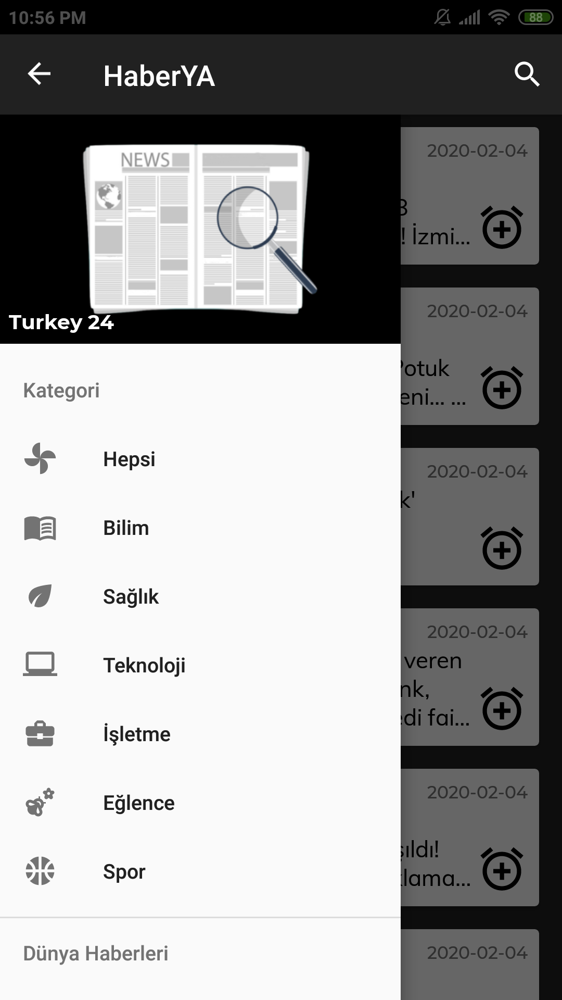
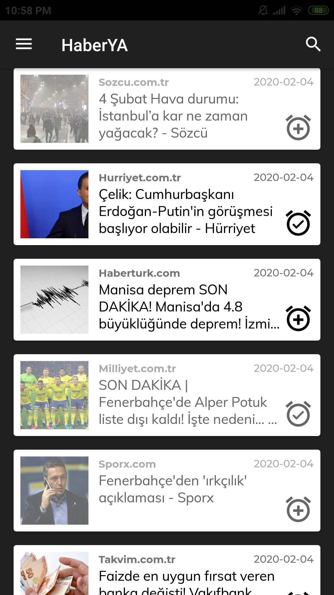
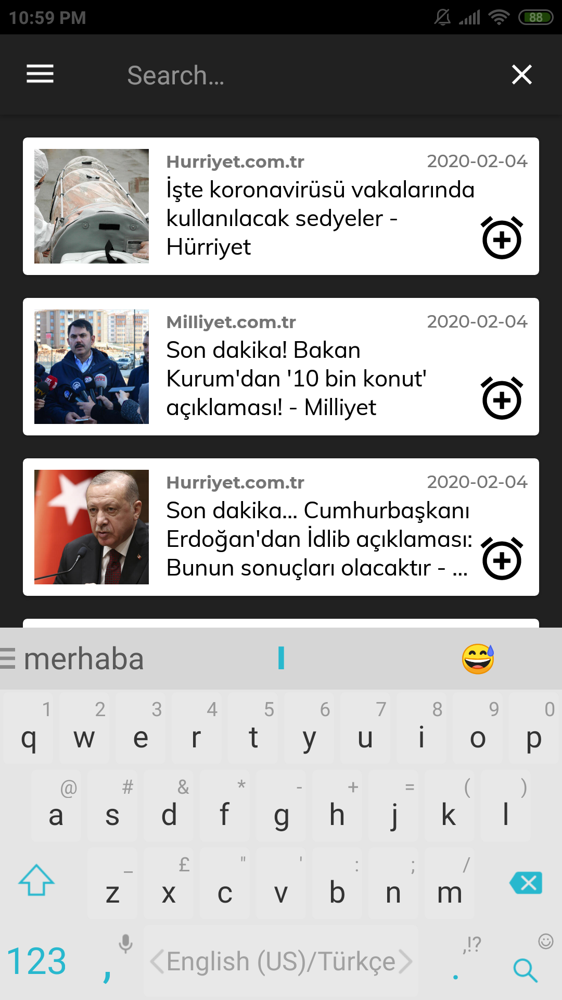
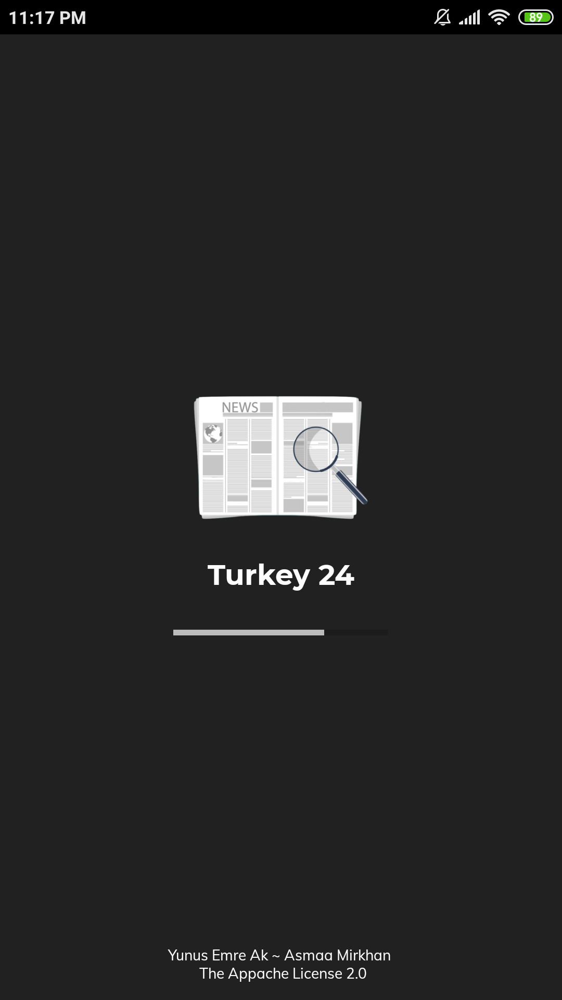

# 📰 News-App

📰 Haber uygulaması

## ✨ Özellikleri

- 🚫 Reklamsız haber okuma (sitelerde dahi reklamı engeller)
- 🗃️ Farklı kaynaklardan haberleri tek bir arayüzde görme
- ✨ Temiz ve hızlı arayüz

> 👀 Detaylı bilgi için [📂 docs](./docs) dizinine bakabilirsiniz

## 🏗️ Temel Yapı

## 🧰 Kullanılan Yapılar

- ✔️ AsyncTask
- ✔️ JSON parsing
- ✔️ Volley (HTTP Request)
- ✔️ RecycleView
- ✔️ Picasso
- ✔️ Room Database
- ✔️ Global Instance
- ✔️ Exception Handler
- ✔️ onClick Handler
- ✔️ Implicit Intent
- ✔️ Explicit Intent
- ✔️ Contextual Action Bar Actions
- ✔️ POJO & Relation in RoomDB
- ✔️ Interface & Lambda Functions
- ✔️ WebView ile gömülü tarayıcı
- ✔️ Reklam Engelleme
- ✔️ Navigation Drawer

## ✍ Elle Yazılmış Notlar

## 🔗 Faydalı Bağlantılar

### 👩‍💻 Fonksiyonellik

- [🔗 JSoup](https://medium.com/@ssaurel/learn-to-parse-html-pages-on-android-with-jsoup-2a9b0da0096f)
- [💫 NewsAPI](https://newsapi.org/docs)
- [💡 NewAPI Request Infos](https://newsapi.org/docs/endpoints/sources)
- [👮‍♂️ Volley ile HTTP İstekleri](https://developer.android.com/training/volley)
- [🗂️ RoomDatabase](https://android.yemreak.com/veriler/room-database)
- [👇 RecycleView on click](https://developer.android.com/guide/topics/ui/layout/recyclerview#select)
- [🚫 Android block ads in webview](https://stackoverflow.com/a/39152846/9770490)
- [👨‍💻 Hacking up an ad blocker for Android](https://www.hidroh.com/2016/05/19/hacking-up-ad-blocker-android/)
- [📋 Ad Url List](https://pgl.yoyo.org/as/)
- [🐣 How to access a file from asset/raw directory](https://stackoverflow.com/a/45908819/9770490)
- [🙄 Suppress potential NullPointerException in Android Studio](https://stackoverflow.com/a/36253248/9770490)
- [🎞 Navigation Drawer Tutorial](https://medium.com/quick-code/android-navigation-drawer-e80f7fc2594f)

### 👩‍🎨 Tasarım

- [ 🎴 Picasso kütüphanesi ile URL'den resim çekip ImageView'da gösterme](https://square.github.io/picasso/)
- [🎨 Material Design'a uygun renk paleti oluşturma](https://material.io/resources/color)
- [🔠 Google Fonts](https://fonts.google.com/)

## 🛒 Store Açıklaması

### 🎈 Short Decription
- 🎉 Dünyanın farklı haber ajanslarından gelen haberlerin takip uygulaması

### 🎀 Long Description
- 🕵️‍♀️ HaberYA uygulaması dünyanın farklı haber ajanslarından gelen haberleri takip etmenizi sağlar
- 🎁 Farklı kategorilere, dillere ve ülkelere ait haber ajanslarının tek bir havuz olarak sunar
- 💖 Sunduğu özel ve sade arayüzü ile beğendiğiniz veya diakkatinizi çeken daha sonra tekrar ulaşabilmek için kaydetmenizi veya farklı platformlar üzerinden paylaşmanızı sağlar
- 🎉 Daha iyi bir deneyim sunmak için istediğiniz konu ile ilgili arama yapabilmenizi sağlar
- 💁‍♂️ HaberYA ile haberleri reklamsız okmanın keyfini çıkarın
- ✨ Ve daha fazlası

### 🎴 Featured Image

### 🤳 Screenshots

