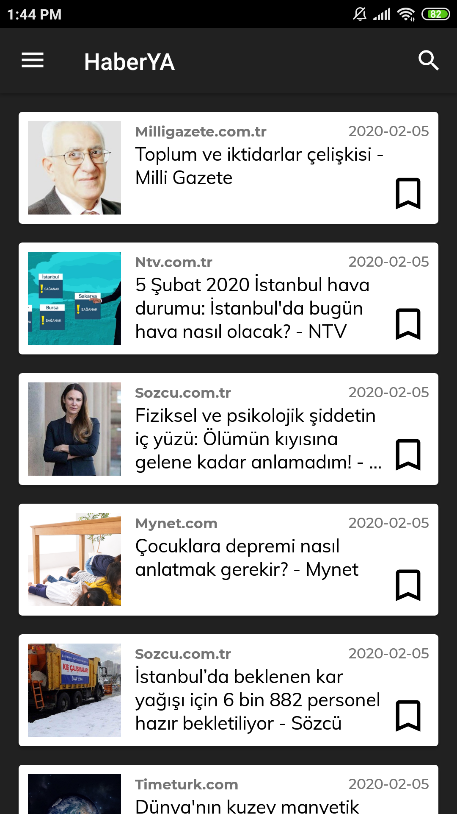
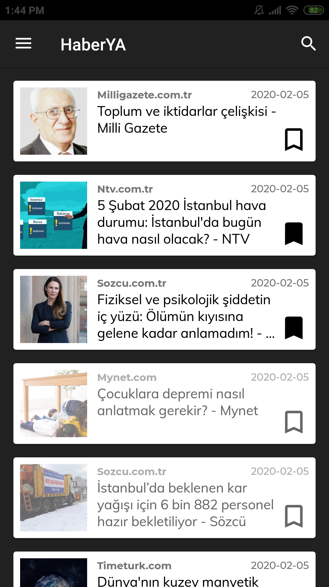
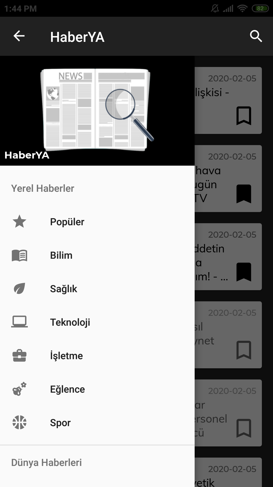
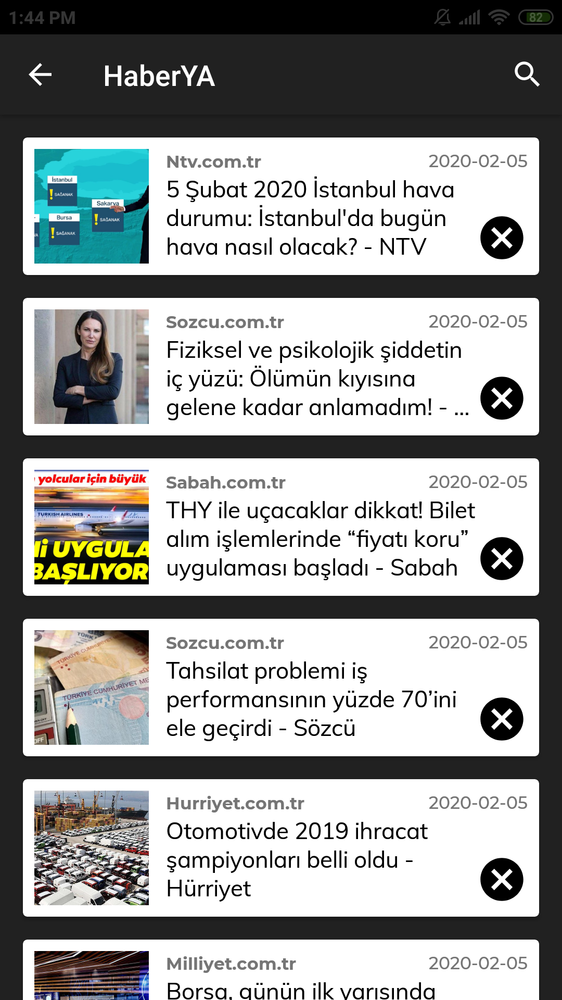
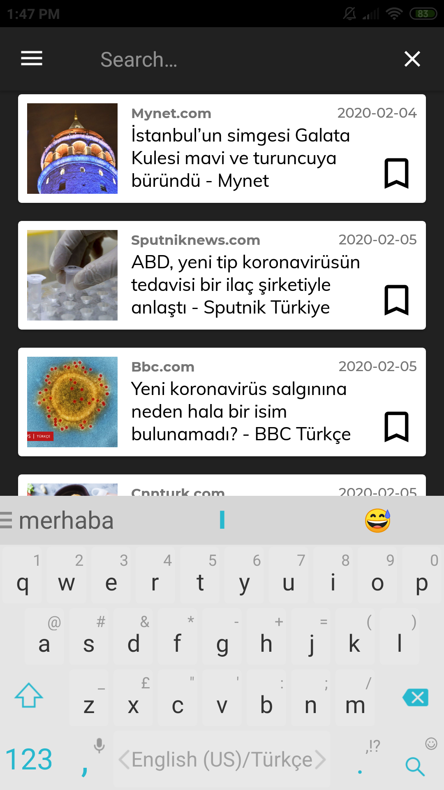
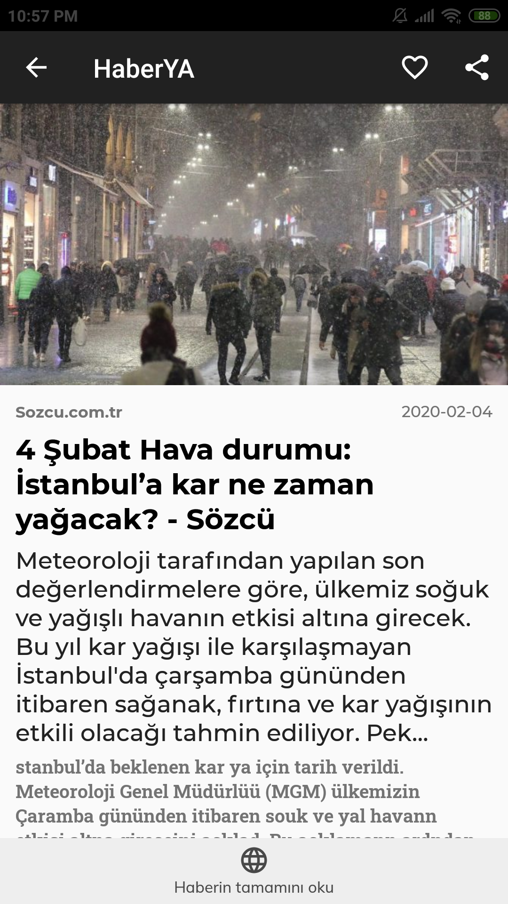
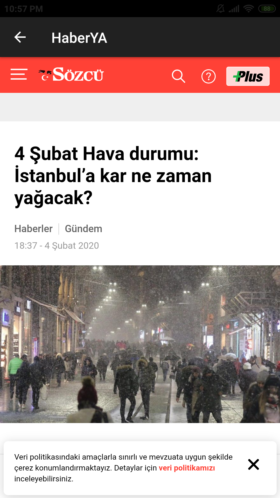
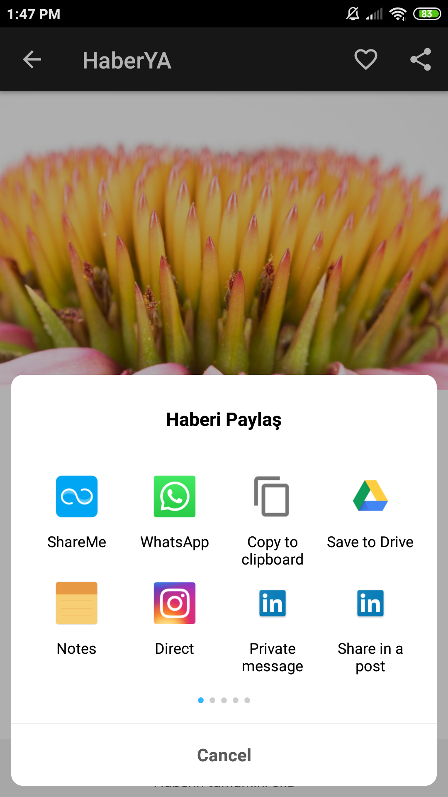

# 📰 HaberYA

📰 Haber uygulaması

## 🛒 Store Açıklaması

### 🎈 Short Decription

- 🎉 Dünyanın farklı haber ajanslarından gelen haberleri reklamsız takip et!

### 🎀 Long Description

- 🕵️‍♀️ HaberYA uygulaması dünyanın farklı haber ajanslarından gelen haberleri takip etmenizi sağlar
- 🎁 Farklı kategorilere, dillere ve ülkelere ait haber ajanslarının tek bir havuz olarak sunar
- 💖 Sunduğu özel ve sade arayüzü ile beğendiğiniz veya dikkatinizi çeken haberleri, daha sonra tekrar ulaşabilmek için kaydetmenizi veya farklı platformlar üzerinden paylaşmanızı sağlar
- 🎉 Daha iyi bir deneyim sunmak için, istediğiniz konu ile ilgili arama yapabilmenizi sağlar
- 💁‍♂️ HaberYA ile haberleri reklamsız okmanın keyfini çıkarın, ve daha önemlisi, linkleri HaberYA ile görüntüleyin!
- 🤓 Ve daha fazlası

### 🎴 Featured Image

### 🤳 Screenshots

	
	
	
</dev>

	
	
	

	
	
	
	

### 🖼 Logo (512x512)

